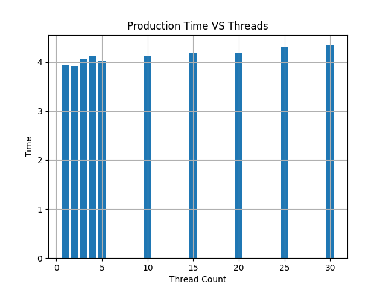

# 05 Prove: Factories and Dealerships

## Overview

You will be using queue(s) and thread semaphore(s) to synchronize many threads in the production and selling of cars.

## Project Description

This is a continuation of assignment 04.  Instead of one factory and one dealership, will have multiple of each.  The restriction of only producing `MAX_QUEUE_SIZE` is still in place for all of the dealerships.

## Assignment

1. Download the [assignment.py](assignment/assignment.py) file.
2. Review the instructions found in the Python file as well as the global constants.
3. Your goal is for each factory to produce `CARS_TO_CREATE_PER_FACTORY` many cars.
4. The function `run_production()` will be passed different number of factories and dealerships that are to be created for a production run.
5. The program will create a plot of the production time VS number of threads used.


Sample output:

```
08:35:34| 200 cars have been created = 3.95057450
[200]
08:35:38| 400 cars have been created = 3.91286310
[198, 202]
08:35:42| 600 cars have been created = 4.05465940
[198, 205, 197]
08:35:46| 800 cars have been created = 4.12323340
[205, 195, 200, 200]
08:35:50| 1000 cars have been created = 4.02148100
[194, 200, 206, 200, 200]
08:35:54| 2000 cars have been created = 4.11957210
[196, 208, 202, 194, 199, 199, 200, 204, 202, 196]
08:35:59| 3000 cars have been created = 4.17968270
[203, 200, 201, 202, 200, 197, 194, 200, 200, 201, 201, 206, 205, 193, 197]
08:36:03| 4000 cars have been created = 4.17816700
[196, 201, 200, 203, 195, 198, 203, 205, 199, 201, 193, 199, 200, 206, 199, 196, 203, 203, 197, 203]
08:36:07| 5000 cars have been created = 4.31302600
[204, 195, 197, 205, 198, 201, 200, 207, 198, 199, 204, 196, 206, 195, 200, 204, 194, 206, 192, 191, 209, 197, 201, 193, 208]  
08:36:12| 6000 cars have been created = 4.33806250
[212, 203, 201, 199, 190, 206, 199, 201, 197, 203, 195, 198, 201, 188, 193, 198, 206, 200, 199, 204, 197, 209, 206, 208, 198, 201, 199, 206, 192, 191]
```


Sample final plot:




## Rubric

Assignments are not accepted late. Instead, you should submit what you have completed by the due date for partial credit.
The Assignment will be graded in broad categories according to the following:

| Grade | Description |
|-------|-------------|
| 0% | Nothing submitted |
| 50% | Some attempt made |
| 75% | Developing (but significantly deficient) |
| 85% | Slightly deficient |
| 93% | Meets requirements |
| 100% | Showed creativity and extend your assignments beyond the minimum standard that is specifically required |

## Submission

When finished, upload your Python file to Canvas.